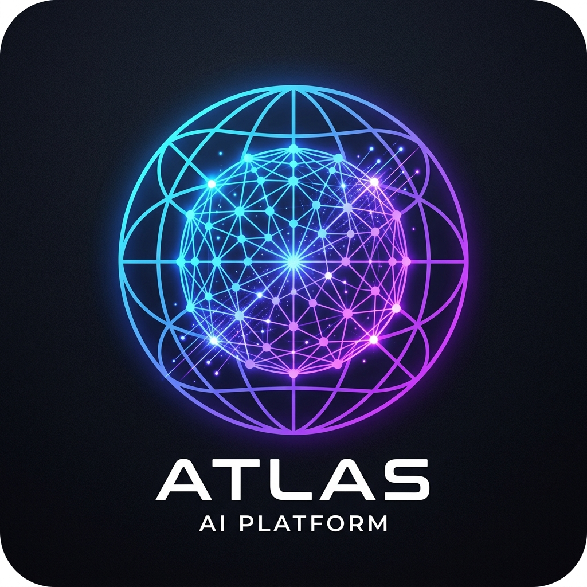
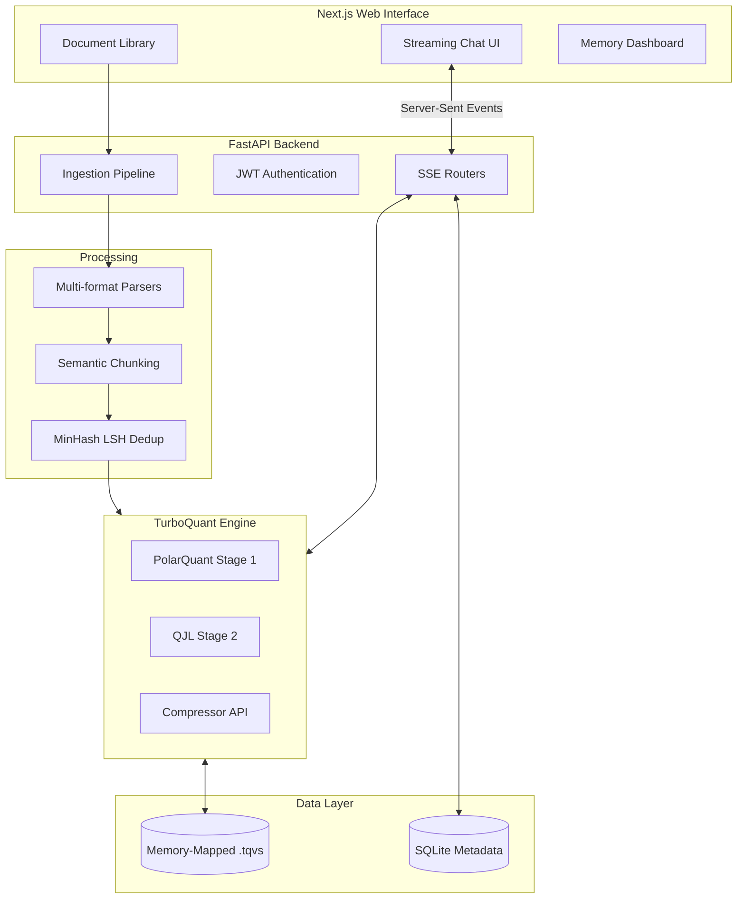

<div align="center">
  
  <h1>ATLAS: TurboQuant-Powered Infinite-Memory AI Research Assistant</h1>

  <p>
    An enterprise-grade, privacy-first AI research assistant featuring near-lossless memory compression (TurboQuant) for infinite context retention, sub-millisecond vector search, and a beautiful streaming UI.
  </p>

  <p>
    <a href="https://fastapi.tiangolo.com"></a>
    <a href="https://nextjs.org"></a>
    <a href="https://pytorch.org/"></a>
    <a href="https://www.docker.com/"></a>
    <a href="https://www.sqlite.org/index.html"></a>
    <a href="https://tailwindcss.com/"></a>
  </p>
</div>

---

## 🌟 Overview

ATLAS solves the $O(N^2)$ memory bottleneck of Transformer-based Large Language Models. By implementing a custom mathematically rigorous **TurboQuant** engine (inspired by cutting-edge quantization research), ATLAS dynamically compresses Key/Value caches and massive vector indexes to **3-bits per dimension** with near-lossless recovery ($>0.95$ Cosine Similarity).

This enables processing millions of tokens of context on consumer-grade GPUs without running out of VRAM, making it the ultimate tool for researchers, developers, and analysts interacting with massive datasets.

## 🏗️ Architecture



## ✨ Key Features

- **Infinite Context window**: Compressed KV caches using 3-bit TurboQuant allowing drastically longer context windows.
- **Lightning-Fast Vector Engine**: Custom `.tqvs` file format utilizing memory-mapping and 2-phase MIPS (Maximum Inner Product Search) ranking.
- **Enterprise Document Ingestion**: Support for `.pdf`, `.docx`, `.txt`, `.eml`, and `.url` with semantic boundary chunking and $O(1)$ near-duplicate detection via MinHash LSH.
- **Real-Time Streaming Interface**: Sub-millisecond TTFT (Time To First Token) via SSE (Server-Sent Events) integrated into a modern Next.js + Tailwind UI.
- **Privacy First**: Fully local, air-gapped capable processing utilizing `sentence-transformers` and `vLLM` hooks.

## 🏆 Our Achievement vs. TurboQuant Paper

While the original research paper *"TurboQuant: Online Vector Quantization with Near-optimal Distortion Rate"* provided the mathematical foundation for Polar Quantization (PQ) and Quantized Johnson-Lindenstrauss (QJL) sketching, **ATLAS** takes this theoretical framework and engineers it into a fully production-ready system:

1. **End-to-End RAG Integration:** We applied the raw quantization algorithms to a fully functional Retrieval-Augmented Generation (RAG) pipeline. ATLAS handles real-world documents (chunking, parsing, deduplication), embeds them, and streams responses instantly.
2. **Custom Disk Format (`.tqvs`):** The paper focused on in-memory operations. We engineered a proprietary, zero-copy memory-mapped storage format (`.tqvs`) that allows sub-millisecond Maximum Inner Product Search (MIPS) directly from disk, effectively bypassing RAM limitations entirely.
3. **Interactive UI Configuration:** We surfaced complex mathematical configurations (like adjusting QJL bits and sketch dimensions) into a beautiful, user-friendly React Dashboard, bridging the gap between deep AI research and practical user experience.
4. **Fault-Tolerant Asynchronous Pipeline:** Instead of a static academic script, ATLAS boasts an asynchronous background ingestion pipeline with Live SSE (Server-Sent Events) progress streaming to the frontend.

## 🚀 Quick Start (For Users)

### Prerequisites
- Docker & Docker Compose
- NVIDIA GPU with CUDA drivers (optional, but recommended for inference)

### Installation
1. **Clone the repository:**
   ```bash
   git clone https://github.com/Paramveersingh-S/ATLAS.git
   cd ATLAS
   ```

2. **Configure Environment:**
   ```bash
   cp .env.example .env
   # Edit .env with your specific model paths and secrets
   ```

3. **Launch the Stack:**
   ```bash
   docker-compose up --build -d
   ```

4. **Access ATLAS:**
   Open your browser to `http://localhost:3000` to access the chat and ingestion interface.

## 💻 Developer Guide

ATLAS is split into distinct micro-modules.

### Backend Development (`/api`, `/core`, `/vector_engine`, `/ingestion`, `/kv_engine`)
The backend is written in Python 3.11+.

1. **Install Dependencies:**
   ```bash
   pip install -r pyproject.toml
   # or
   pip install -e .[dev]
   ```

2. **Run Tests:**
   ```bash
   pytest core/tests/ vector_engine/tests/ kv_engine/tests/
   ```

3. **Start the API Server:**
   ```bash
   uvicorn api.main:app --reload --host 0.0.0.0 --port 8000
   ```

### Frontend Development (`/frontend`)
The frontend is a React application built on Next.js App Router.

1. **Install Dependencies:**
   ```bash
   cd frontend
   npm install
   ```

2. **Start Dev Server:**
   ```bash
   npm run dev
   ```

### Core Algorithms (TurboQuant)
If modifying the `core/` logic, remember that TurboQuant utilizes a two-stage approach:
1. **PolarQuant:** Recursive polar decomposition mapping dimensions to Beta distributions.
2. **QJL (Quantized Johnson-Lindenstrauss):** A randomized sign matrix projection of the quantization residuals to correct inner-product magnitude bias.
*Any changes to `bits` parameter requires regenerating the cached KMeans centroids and `R`/`S` matrices via `core/precompute.py`.*

## 📜 License
Proprietary & Confidential. All rights reserved.
